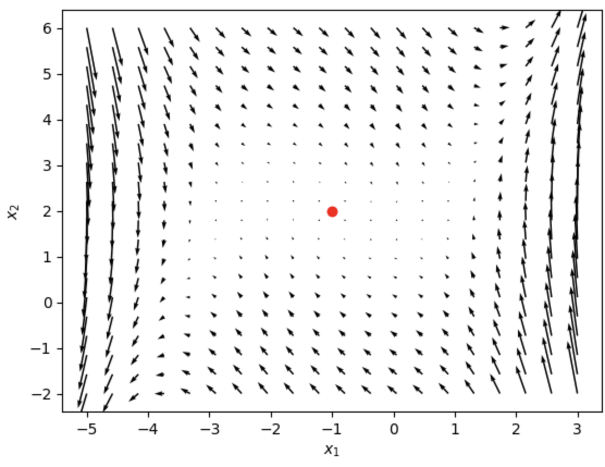
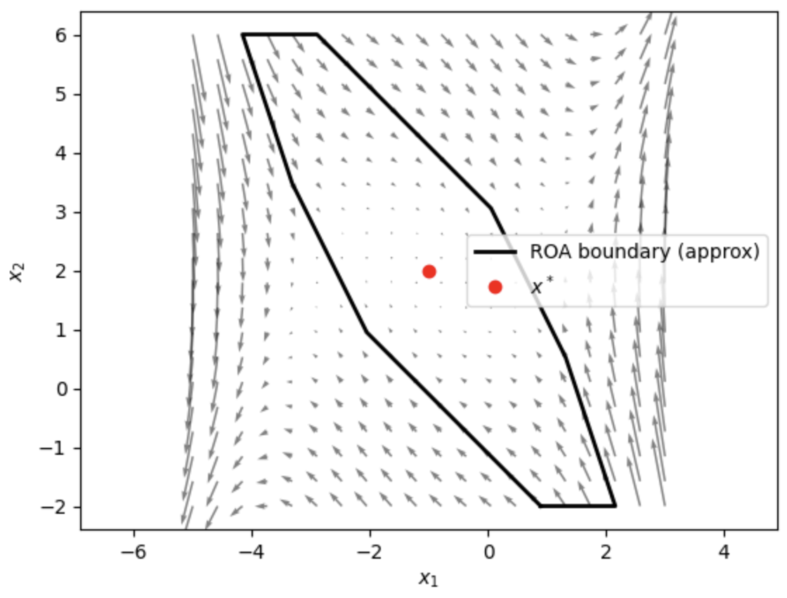
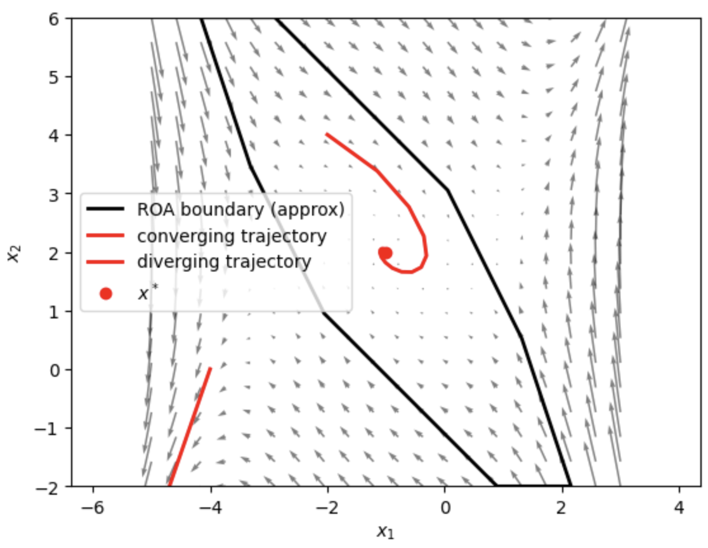
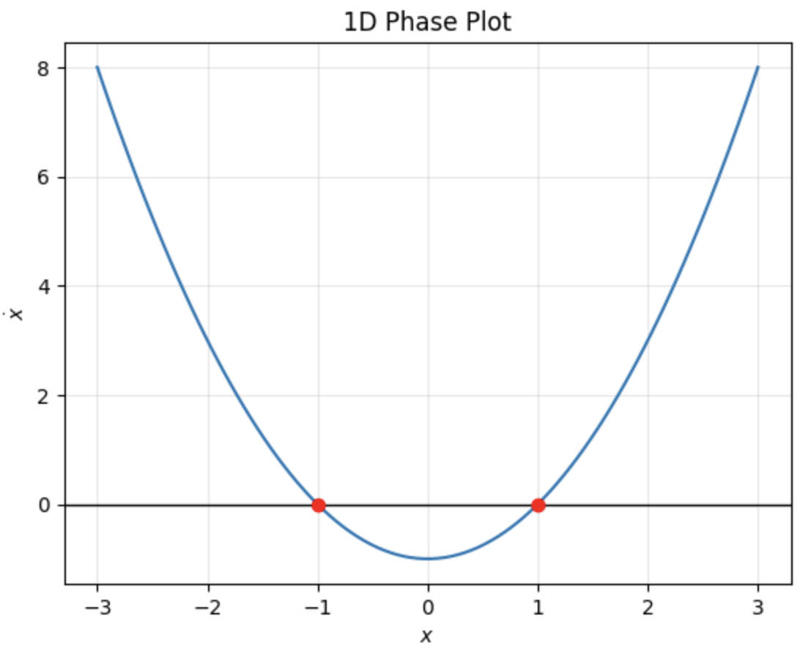
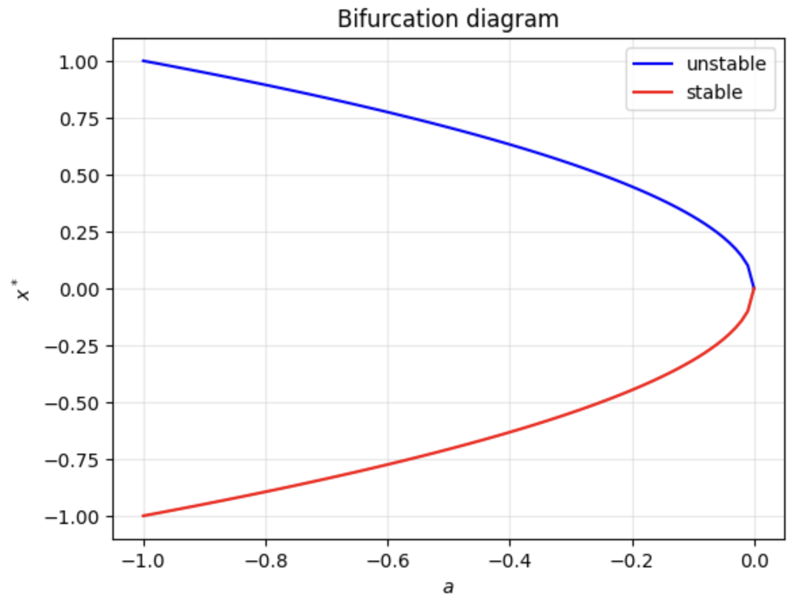

# HW1 — Stability of Linear & Nonlinear Systems

Full writeup: [`Controls_HW_1.pdf`](Controls_HW_1.pdf). Problem statement: [`MEAM_517_Problem_Set_1-1.pdf`](MEAM_517_Problem_Set_1-1.pdf). `hw1.py` / `hw1.ipynb` are supplementary code (numeric checks + phase-portrait plots) referenced from the PDF, not the main deliverable.

## Topics covered

1. **Discrete system with delay** — derive stability condition (spectral radius < 1) for state-augmented systems under 1-step and 2-step delayed feedback; construct a concrete gain `K` that stabilizes the undelayed system but destabilizes the delayed one.
2. **Uncertain pendulum** — find a set of gains `(K1, K2)` that robustly stabilize a linearized inverted pendulum over a range of uncertain parameters (ω² ∈ [5,10], γ ∈ [0,1]), via worst-case Routh–Hurwitz-style conditions on the characteristic polynomial.
3. **Exponential stability and friction** — prove no PD gains can make a block-with-friction system exponentially (or even asymptotically) stable at the origin, using a sticking-region counterexample.
4. **Gradient flow** — show strong convexity of the loss implies local exponential stability of gradient flow at the minimizer; derive the step-size bound for discrete-time gradient descent to remain (globally) stable.
5. **2D nonlinear equilibrium** — find equilibria of a 2D nonlinear system, classify stability via Jacobian linearization, compute phase portraits, and approximate the region of attraction numerically (grid sampling + forward integration + convex hull).
6. **1D phase plot / bifurcation** — analyze `ẋ = x² + a`: equilibria, stability by case on `a`, region of attraction, and the bifurcation diagram as `a` varies.
7. **Nonlinear system in polar coordinates** — verify an equilibrium point, show the linearization test is inconclusive (zero eigenvalue), then argue convergence directly from the structure of the dynamics (θ monotonically relaxes to 0, then r relaxes to 1).

## Results

**2D nonlinear equilibrium.** Phase portrait around the stable equilibrium `x* = (-1, 2)` (left), then the approximate region of attraction found by grid sampling + forward integration + convex hull (right):

  
  

Sampled trajectories confirming the boundary — one converging to `x*`, one diverging outside it:

  

**1D phase plot / bifurcation.** `ẋ = x² - 1` with its two equilibria (left), and the resulting bifurcation diagram as `a` varies in `ẋ = x² + a` (right):

  
  

