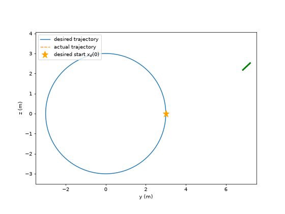
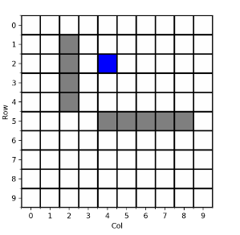
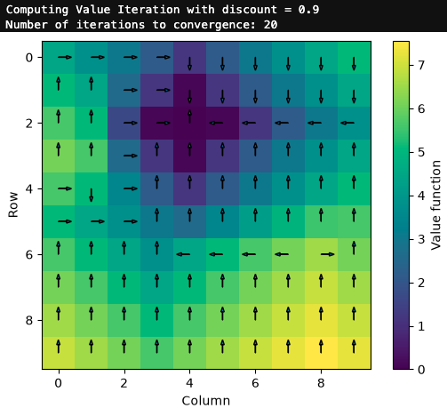
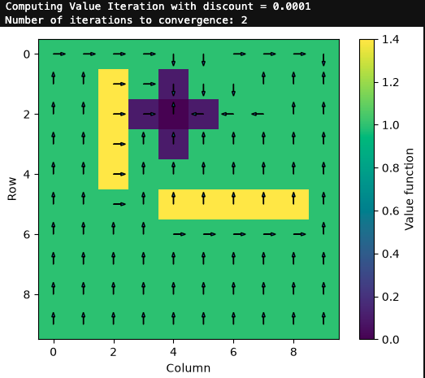

# HW2 — Trajectory Tracking with Time-Varying LQR

Full writeup: [`Controls_HW_2.pdf`](Controls_HW_2.pdf).

## Topics covered

1. **2D quadrotor dynamics & cost design** — derive nonlinear equations of motion for a planar (2-rotor) quadrotor, then hand-design `Q` for three tracking objectives: stabilizing at the origin, driving to a line (`2y = z`, via a rank-deficient `Q` built from the line's normal), and driving to a curve (`z = y²`, shown impossible for a quadratic-in-`x` cost since only linear constraints can live in the null space of `Q`). Also derive how the optimal policy/cost-to-go scale when `Q` is scaled.
2. **Time-varying LQR (TV-LQR) derivation** — linearize the nonlinear dynamics about a desired trajectory `(x_d(t), u_d(t))` to get `A(t), B(t)`, pose the finite-horizon quadratic-cost HJB, and derive the differential Riccati equation for `S(t)` and the optimal feedback law `u_e*(t) = -R⁻¹B(t)ᵀS(t)x_e`.
3. **Square-root (Cholesky) factorization** — factor `S(t) = L(t)L(t)ᵀ` and derive/verify the corresponding ODE for `L(t)`, which is integrated backward from `L(t_f)` (via Cholesky of `Q_f`) for better numerical stability than integrating `S(t)` directly.
4. **TV-LQR applied to the quadrotor** ([`quadrotor/`](quadrotor/)) — implement `A(t)`, `B(t)`, the `L̇` ODE, and the feedback controller in [`quadrotor.py`](quadrotor/quadrotor.py), simulate the closed loop in [`quad_sim.py`](quadrotor/quad_sim.py), and track a circular reference trajectory from a far-off initial condition.
5. **Grid-world value iteration** ([`grid_world/`](grid_world/)) — build a stochastic 10x10 grid world with wall/"sticky"-state costs in [`grid_world.py`](grid_world/grid_world.py), implement tabular value iteration in [`value_iteration.py`](grid_world/value_iteration.py), and study how the discount factor `γ` trades off convergence speed against policy greediness.

## Results

**TV-LQR tracking a circular trajectory.** Starting far off the reference (`x_e(0) = [4.03, 2.35, 0.46, -1.04, 1.51, -1.77]`, ~4.7 m position error, tilted and moving the wrong way), the TV-LQR controller pulls the quadrotor back onto the circle within ~3 s and then tracks it to within ~1 mm by `t_f = 2π` (animation slowed ~2x):

<p align="center">
  
</p>

**Grid-world value iteration.** The environment (goal in blue, walls/"sticky" states in gray):

<p align="center">
  
</p>

Value function + greedy policy for `γ = 0.9` (converges in 20 iterations) vs. `γ = 1e-6` (converges in 2 iterations but the near-sighted policy takes worse paths around the sticky states):

<p align="center">
  
  
</p>

## Running the code

```bash
cd quadrotor && python quad_sim.py       # simulate + plot TV-LQR trajectory tracking
cd grid_world && python value_iteration.py  # run value iteration + plot result
```

`quadrotor/hw2_quadrotor_sim.ipynb` contains the full exploration of initial conditions. The tracking animation above is rendered with `create_animation()` from [`create_animation.py`](quadrotor/create_animation.py) using `x0 = x_d(0) + x_e(0)` with the `x_e(0)` given above.
