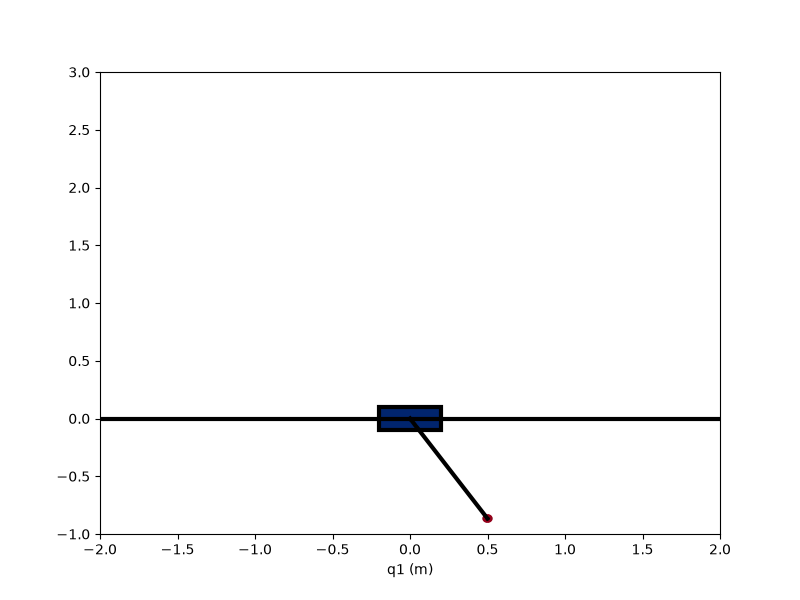
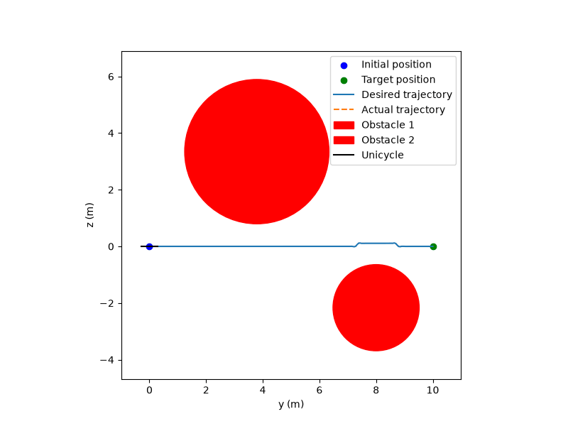

# HW3 — Energy-Shaping Swing-Up & Differential-Flatness Control

Full writeup: [`Controls_HW_3.pdf`](Controls_HW_3.pdf).

## Topics covered

1. **Cartpole energy shaping + swing-up** ([`cartpole_energy_shaping/`](cartpole_energy_shaping/)) — derive an energy-shaping control law that pumps the pendulum's energy `E = ½θ̇² - g·cos(θ) - g` toward the upright equilibrium's energy (`Ẽ = 0`), add a PD term on the cart position so the swing-up doesn't drive the cart off to infinity, and switch to an LQR balancing controller ([`cartpole.py`](cartpole_energy_shaping/cartpole.py)) once the state is close enough (in energy error + angular distance) to the unstable equilibrium `(θ, θ̇) = (π, 0)`.
2. **Unicycle differential flatness** ([`unicycle_diff_flat_controller/`](unicycle_diff_flat_controller/)) — show `(y, z)` are flat outputs for the unicycle `ẏ = cos(θ)v, ż = sin(θ)v, θ̇ = ω`, invert the flat map to get feedforward inputs `(ω, v)` from a desired `(y_d(t), z_d(t))` and its derivatives ([`unicycle_input.py`](unicycle_diff_flat_controller/unicycle_input.py)), and design a `C²` spline trajectory from `(0,0)` to `(10,0)` that detours around two randomly-placed circular obstacles while keeping `ẏ > 0` everywhere ([`unicycle_spline.py`](unicycle_diff_flat_controller/unicycle_spline.py)).

## Results

**Cartpole swing-up.** Starting near the downward equilibrium (`θ(0) = π/6` from hanging), energy shaping pumps the pendulum up through several swings; once close enough to `(θ, θ̇) = (π, 0)` the controller switches to LQR and locks it there:

<p align="center">
  
</p>

**Unicycle differential-flatness tracking.** Feedforward `(ω, v)` inverted from a spline that detours around two randomly-placed obstacles while going from `(0,0)` to `(10,0)`:

<p align="center">
  
</p>

## Running the code

```bash
cd cartpole_energy_shaping && python cartpole_sim.py           # simulate swing-up + LQR balance
cd unicycle_diff_flat_controller && python unicycle_sim.py     # simulate spline-tracking with obstacle avoidance
```

`cartpole.ipynb` / `unicycle.ipynb` contain the full exploration used to generate the animations above.
